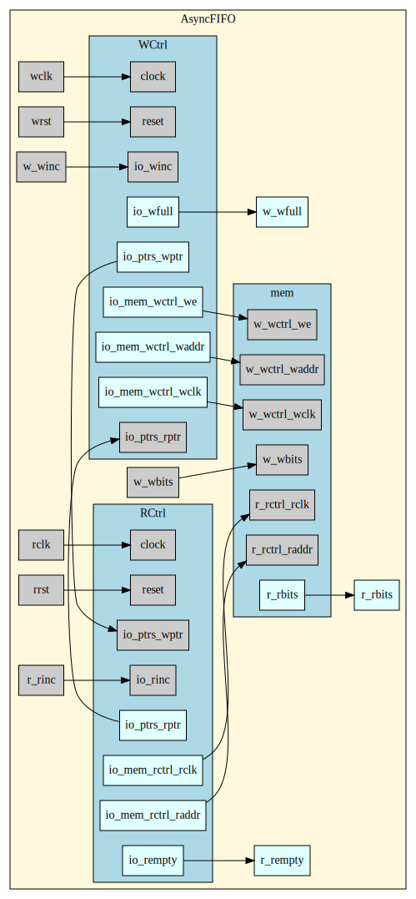

Toy Asynchronous FIFO Generator
=======================

(This repository originated as a submission to CNRV Challenge CH002.)

This project offers an chisel3 reinterpretation of the Verilog code from the well-known article [Simulation and Synthesis Techniques for Asynchronous FIFO Design](http://www.sunburst-design.com/papers/CummingsSNUG2002SJ_FIFO1.pdf).

## Generation

Before generating your desired asynchronous FIFO, modify `src/main/scala/afifo/main.scala` to achieve a correct data type and depth. Assuming that you have changed to the project root directory, run the following in your terminal:

```bash
make build
```

The generated annotations, firrtl files and verilog files should lie in `build/`.

## Simulation

Please make sure to have [GTKWave](http://gtkwave.sourceforge.net/), [Icarus Verilog](http://iverilog.icarus.com/) and [SVUT](https://github.com/dpretet/svut) installed. Assuming that you have changed to the project root directory.

### CLI Test

If you only want to read the report, run the following in your terminal:

```bash
$ cd test/svut
$ make test
```

The simulation report should show in the terminal.

### GUI Test

If you want to have a glance at the waves, run the following in your terminal:

```bash
$ cd test/svut
$ make gui
```

GTKWave will then be launched while the simulation report should show in the terminal. Some simulation-related files will be generated at the same time, to delete which:

```bash
$ cd test/svut
$ make clean
```

## Source Files

* Main Components:
  * `AsyncFIFO.scala`: The top-level module for the asynchronous FIFO.
  * `WCtrl.scala`: The controller of the writing side. Pointer CDC is handled internally.
  * `RCtrl.scala`: The controller of the reading side. Pointer CDC is handled internally.
  * `S2P.scala`: A simple dual port memory model where neither the address nor the data is registered.
* Miscellaneous logics:
  * `gray.scala`: Binary->Gray conversion logic and gray-encoded pointer comparison logics.
* Interface bundles:
  * `CtrlPtrIO.scala`: Pointer exchange interface for `WCtrl` and `RCtrl`.
  * `MemReadPortCtrlIO`: Read clock and read address.
  * `MemWritePortCtrlIO`: Write clock, write enable and write address.
  * `MemReadPortIO`:  `MemReadPortCtrlIO` and read data.
  * `MemWritePortIO`:  `MemWritePortCtrlIO` and written data.

## Design Internals

The module is separated into three components (corresponding to the clock domains coincidentally):



The pointer CDC are handled with gray codes and the pointers are synchronized inside both controllers.